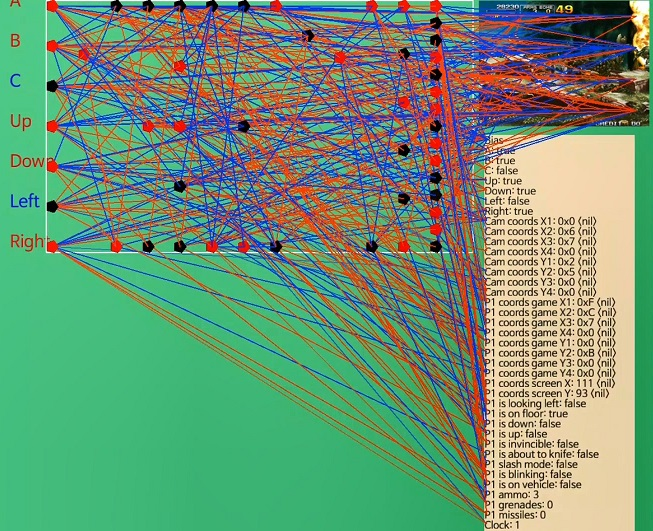
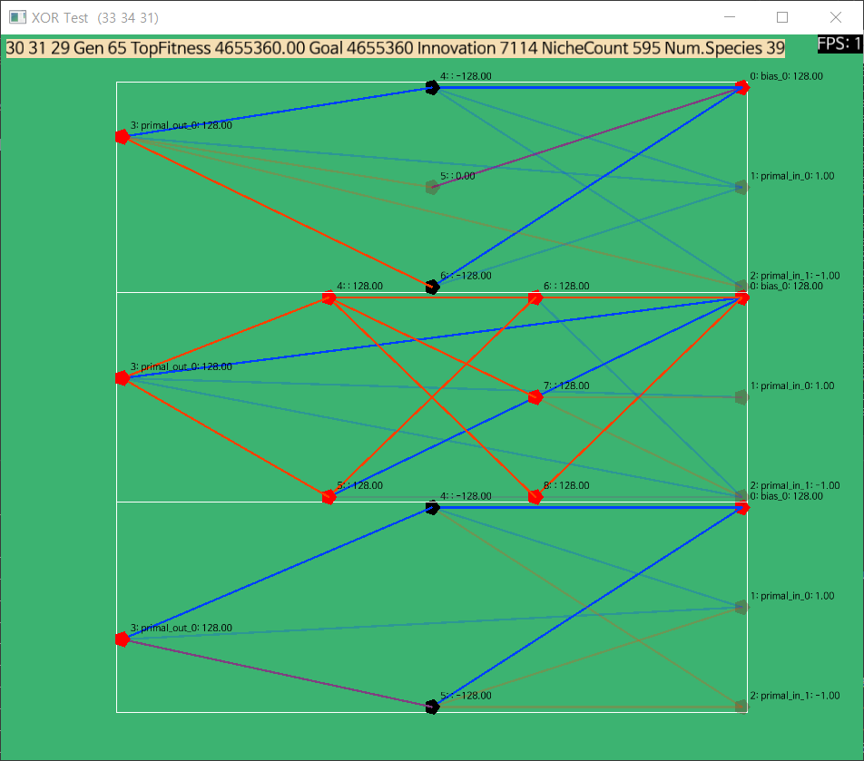

# NaNEAT?

[](https://godoc.org/github.com/nanitefactory/naneat)
[](https://travis-ci.org/NaniteFactory/naneat)


NaNEAT is a NEAT library made from scratch that's mostly for my own use. It is multi-threaded, and designed that way to become one day to be extended to a horizontally scalable microservice.

## NEAT

NEAT (Neuro-Evolution of Augmenting Topologies) is a genetic algorithm developed by Dr. Kenneth O. Stanley in 2002. Being based on the neuroevolution technique which evolves both topology and weights of an artificial neural network, NEAT starts out with a population of minimal structures and adds structure as necessary in order to minimize the number of parameters being searched. This allows the network topology to grow only as it benefits the solution, and through its learning process the structure of the neural network complexifies.

## Installation

<!--You may install `naneat` with following command.-->

```Bash
go get -v github.com/nanitefactory/naneat
```

<!--And, that's it. No other preliminary requirements are there other than a [correctly configured](https://golang.org/doc/install#testing) Go toolchain.-->

## Empirical Proofs

<!--Thoroughly tested!-->

### Learns to play Metal Slug 3



Video: https://www.youtube.com/watch?v=rjrheRsWXR4

### Solves XOR Problem



## Example

In order to conduct the XOR test implemented in this package, test run `func naneat.TestMain(*testing.M)`.

```Bash
go test -run TestMain
```

And the code below initiates a NEAT context that runs with 3 agents.

```Go
conf := naneat.NewConfigurationSimple(1, 2, 1)
experimenter := naneat.New(conf)

agent1, agent2, agent3 := naneat.NewAgent(), naneat.NewAgent(), naneat.NewAgent()
experimenter.RegisterMeasurer(agent1)
experimenter.RegisterMeasurer(agent2)
experimenter.RegisterMeasurer(agent3)

go experimenter.Run()
```

(Further detail of that sample is included in the standard test code in this package.)

## Features

- Cross-platform throughout desktop environments; Windows, Linux and macOS.
- The library may not depend on a particular programming language to use.
- Entire codebase is written in Go which makes it lightweight and easier to maintain.
- The experiment process is fully visualizable with [faiface/pixel](https://github.com/faiface/pixel).
- Can save/load the state serialized in JSON.
- Offers a plain easy interface designed to be multi-threaded and may be said, horizontally scalable.

## Todo

- Performance evaluations
- More tests and benchmarks
- Documentation

## References

- [NEAT Users Page](https://www.cs.ucf.edu/~kstanley/neat.html)
- [(Paper) Evolving Neural Networks through Augmenting Topologies](http://nn.cs.utexas.edu/downloads/papers/stanley.ec02.pdf)
- [Dr. Kenneth O. Stanley's original C++ implementation in 2002](http://nn.cs.utexas.edu/?stanley:ec02)
- [MarI/O Lua script written by SethBling](https://pastebin.com/ZZmSNaHX)
- [(Paper) Competitive Coevolution through Evolutionary Complexification](https://www.cs.cmu.edu/afs/cs/project/jair/pub/volume21/stanley04a-html/)
- [(Paper) Efficient Evolution of Neural Networks](http://nn.cs.utexas.edu/downloads/papers/stanley.phd04.pdf)
- [CrAIg blog post](https://medium.com/@savas/craig-using-neural-networks-to-learn-mario-a76036b639ad)
- [Another post on medium](https://medium.com/datadriveninvestor/neuroevolution-neat-algorithm-and-my-neat-b83c5174d8b0)
- [Post on Automatons Adrift](http://www.automatonsadrift.com/neat/)
- [Wikipedia - NEAT](https://en.wikipedia.org/wiki/Neuroevolution_of_augmenting_topologies)
- [Wikipedia - Evolutionary algorithm](https://en.wikipedia.org/wiki/Evolutionary_algorithm)
- [Wikipedia - Neuroevolution](https://en.wikipedia.org/wiki/Neuroevolution)
- [yaricom/goNEAT](https://github.com/yaricom/goNEAT)
- [jinyeom/neat](https://github.com/jinyeom/neat)
- [klokare/evo](https://github.com/klokare/evo)

## License

[MIT](./LICENSE)
